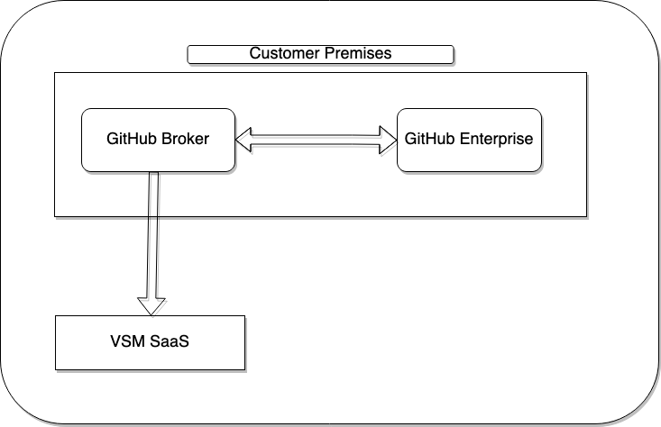

# VSM GitHub Broker

VSM GitHub Broker is used to establish the communication between VSM SaaS Application and GitHub Enterprise on premise
deployments that are not publicly accessible from the internet.

VSM GitHub Broker runs on customers' premises, connects to GitHub Enterprise deployments and transmits the necessary
data to VSM SaaS Application.

### VSM GitHub Broker Diagram



## Usage

The VSM GitHub Broker is published as a Docker image. The configuration is performed with environment variables as
described below.

To use the Broker client with a GitHub Enterprise deployment, run `docker pull acr-public/vsm-github-broker` tag. The following environment variables are mandatory to configure the Broker client:

- `LEANIX_REGION` - the LeanIX region, obtained from your LeanIX settings view (leanix.net).
- `LEANIX_API_TOKEN` - the LeanIX token, obtained from your LeanIX settings view (leanix.net).
- `LEANIX_CONFIGURATION_NAME` - the LeanIX configuration, obtained from your LeanIX settings view (leanix.net).
- `GITHUB_TOKEN` - a personal access token with full `repo`, `read:org` and `admin:repo_hook` scopes.
- `GITHUB_URL` - the hostname of your GitHub Enterprise deployment, such as `ghe.domain.com`.

#### Command-line arguments

You can run the docker container by providing the relevant configuration:

```console
docker run --restart=always \
           -p 8080:8080 \
           -e LEANIX_DOMAIN=<region>-vsm.leanix.net \
           -e LEANIX_API_TOKEN=<technical_user-token>\
           -e LEANIX_CONFIGURATION_NAME=<config-name>\
           -e GITHUB_TOKEN=<secret-github-token> \
           -e GITHUB_URL=<GitHub Ent URL(ghe.domain.com)> \
        leanixacrpublic.azurecr.io/vsm-github-broker
```

#### Webhook configuration

The Broker client exposes a webhook endpoint that can be used to receive events from GitHub Enterprise. The webhook is registered automatically when the Broker client starts up. 

> Note: Make sure to use a unique GitHub token for each Broker client instance. This ensures maximum security and prevents the Broker client from receiving events from other GitHub Enterprise deployments.

### Troubleshooting

#### Using over a http proxy system

Add the following properties on the command:

```console
docker run 
           ...
           -e JAVA_OPTS="-Dhttp.proxyHost=<HTTP_HOST> -Dhttp.proxyHost=<HTTP_PORT> -Dhttp.proxyUser=<PROXY_USER> -Dhttp.proxyPassword=<PROXY_PASS> -Dhttps.proxyHost=<HTTPS_HOST> -Dhttps.proxyHost=<HTTPS_PORT> -Dhttps.proxyUser=<PROXY_USER> -Dhttps.proxyPassword=<PROXY_PASS>" \
        leanixacrpublic.azurecr.io/vsm-github-broker
```

#### Using over SSL Intercepting proxy

Build your own docker image adding the certificate:

```console
FROM leanixacrpublic.azurecr.io/vsm-github-broker


USER root

RUN apk update && apk add ca-certificates && rm -rf /var/cache/apk/*
COPY YOUR-CERTIFICATE-HERE /usr/local/share/ca-certificates/YOUR-CERTIFICATE-HERE
RUN update-ca-certificates

```


#### Using amd64 Images on Apple M1

Just run the container by providing the following command:

```console

docker run --platform linux/amd64 \
           ...
        leanixacrpublic.azurecr.io/vsm-github-broker
```
